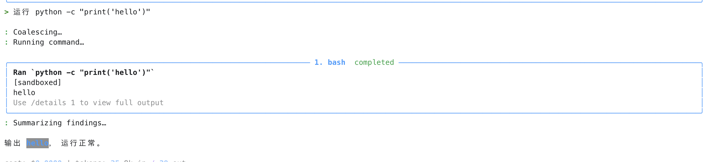
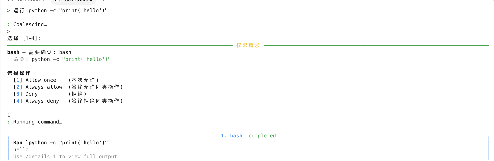

# Sandbox Runtime 测试报告

## CASE-1: sandbox 生效时自动放行 bash

输入：`运行 python -c "print('hello')"`

预期：当 `sandbox.enabled=true`、`autoAllowBashIfSandboxed=true`，且命令没有命中 `excludedCommands` 时，`bash` 调用不再弹权限确认，而是直接通过 sandbox backend 执行。

### settings.json 关键配置

```json
{
  "sandbox": {
    "enabled": true,
    "autoAllowBashIfSandboxed": true,
    "excludedCommands": [
      "git push"
    ],
    "filesystem": {
      "allowWrite": [
        "<cwd>/**"
      ],
      "denyWrite": [
        "**/.git/**",
        "**/.env",
        "**/settings.json"
      ],
      "allowRead": [
        "**"
      ],
      "denyRead": [
        "**/.ssh/**",
        "**/.gnupg/**"
      ]
    },
    "network": {
      "allowDomains": [],
      "denyDomains": [
        "*"
      ],
      "allowLocalhost": false,
      "allowUnixSocket": false
    }
  }
}
```

### 测试结果

如下图，`python -c "print('hello')"` 通过 `bash` 工具执行。因为命令没有命中 `excludedCommands`，且 sandbox backend 可用，所以权限层自动放行。工具结果中出现 `[sandboxed]` 标记，说明命令确实经过 sandbox 包装。



结论：sandbox 自动放行链路正常，`permissions.check_permission()` 和 `BashTool.call()` 的 sandbox 决策保持一致。

## CASE-2: excludedCommands 命中后回到 ASK

输入：`运行 python -c "print('hello')"`

预期：当 `python` 被加入 `excludedCommands` 后，即使 `sandbox.enabled=true` 且 `autoAllowBashIfSandboxed=true`，该命令也不能通过 sandbox 自动放行。由于 `permissions.rules` 中配置了 `bash(*) ask`，因此应弹出权限确认。

### settings.json 关键配置

```json
{
  "sandbox": {
    "enabled": true,
    "autoAllowBashIfSandboxed": true,
    "excludedCommands": [
      "git push",
      "python"
    ],
    "filesystem": {
      "allowWrite": [
        "<cwd>/**"
      ],
      "denyWrite": [
        "**/.git/**",
        "**/.env",
        "**/settings.json"
      ],
      "allowRead": [
        "**"
      ],
      "denyRead": [
        "**/.ssh/**",
        "**/.gnupg/**"
      ]
    },
    "network": {
      "allowDomains": [],
      "denyDomains": [
        "*"
      ],
      "allowLocalhost": false,
      "allowUnixSocket": false
    }
  },
  "permissions": {
    "rules": [
      {
        "tool_name": "bash",
        "pattern": "*",
        "behavior": "ask",
        "source": "user"
      },
      {
        "tool_name": "write_file",
        "pattern": "*",
        "behavior": "allow",
        "source": "user_settings"
      }
    ]
  }
}
```

### 测试结果

如下图，`python` 命中 `excludedCommands` 后，sandbox 自动放行不会触发。由于该命令本质上仍是 `bash(command="python ...")`，所以 `bash(*) ask` 规则生效，终端展示权限请求。用户选择 `Allow once` 后，命令继续执行，但输出中不再出现 `[sandboxed]` 标记。



结论：`excludedCommands` 不等于 deny，它只表示“不要用 sandbox 自动放行这类命令”。命令是否能继续执行，仍由普通权限规则和用户确认决定。

## CASE-3: 设计结论

这组测试验证了 sandbox runtime 和权限系统的边界：

- `bash` 是运行命令的统一工具入口，`python`、`pytest`、`git` 等都属于 `bash` 命令内容。
- `autoAllowBashIfSandboxed` 只在命令真的会被 sandbox 包装时生效。
- `ask` 规则命中 `bash` 时，会先让 sandbox 决策判断；如果不能 sandbox，则回到 ASK。
- `excludedCommands` 用于阻止某类命令走 sandbox 自动放行，不是直接拒绝命令。
- `[sandboxed]` 是判断命令是否真实进入 sandbox 的用户可见信号。

