# Test Cases After Feature Optimization

## CASE-1: Agent Tool Triggering
Input: "Analyze the project design patterns", verify Explore agent is triggered
### Before Improvement
Reading and analyzing large projects took a long time, appearing stuck at "Running Explore agent..."
Results would suddenly appear after a long wait, and the output was not concise enough. Then entering the `/details` command would display details rather abruptly, as shown below.
It took several minutes after input before the following results appeared.

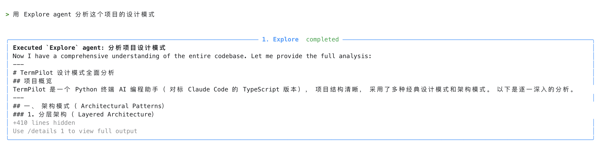
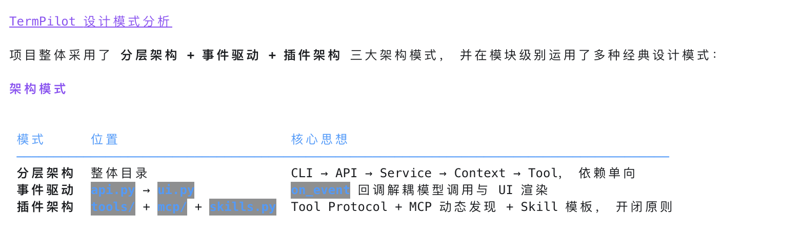
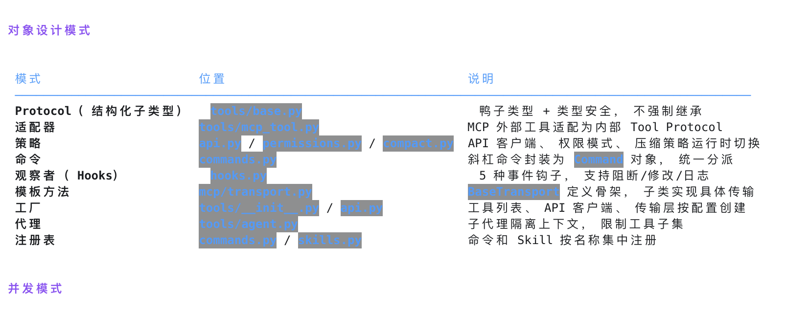
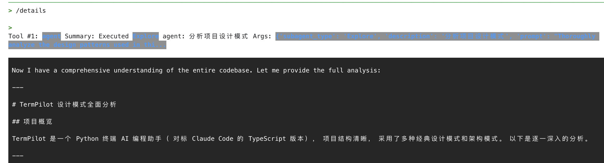

### After Improvement
As shown below, sub-agents now report status back progressively, providing incremental progress output and improving user experience.
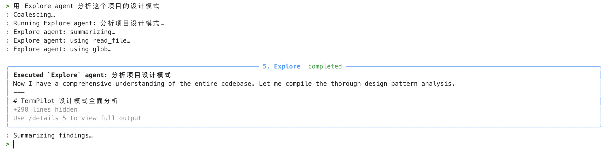
**Returned module summary list (partial screenshots):**
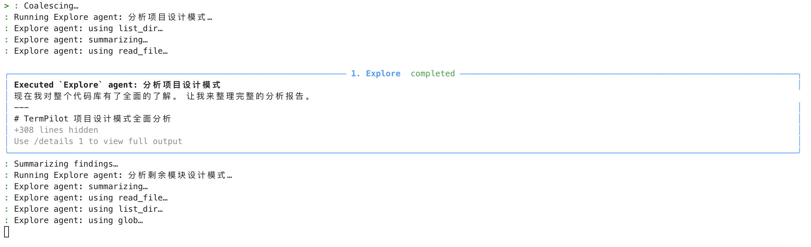
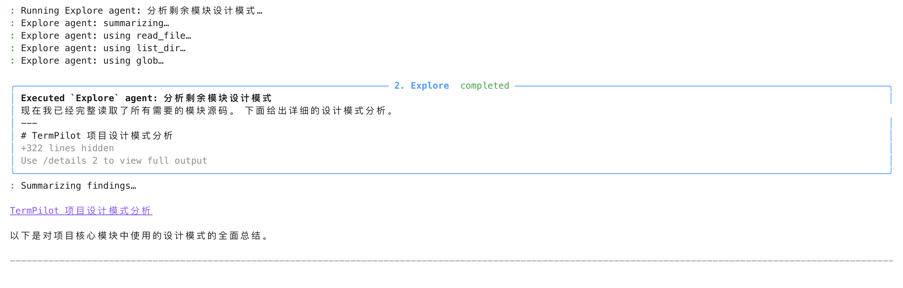
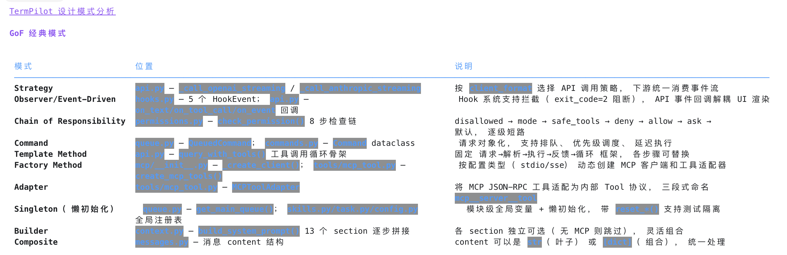
**Partial screenshots from /details response:**
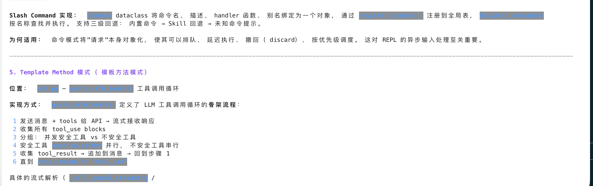

## CASE-2: Slash Commands + Drain Concurrency Safety
Input: "Write a hello world for me", then while the model is responding (when "Coalescing..." is visible), immediately input: `/clear`

Expected: `/clear` will wait for the current file-modifying session to complete before executing, preventing task loss or disorder.

**As shown below, when a task is input and a slash command is entered before execution finishes, the task execution is not interrupted. This avoids task state confusion, context logic drift, and ensures the task stack pops in order.**
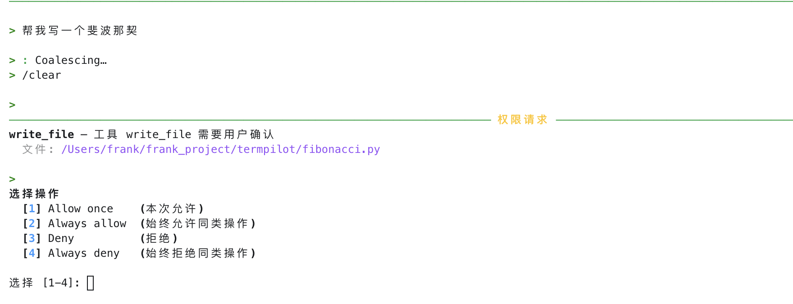
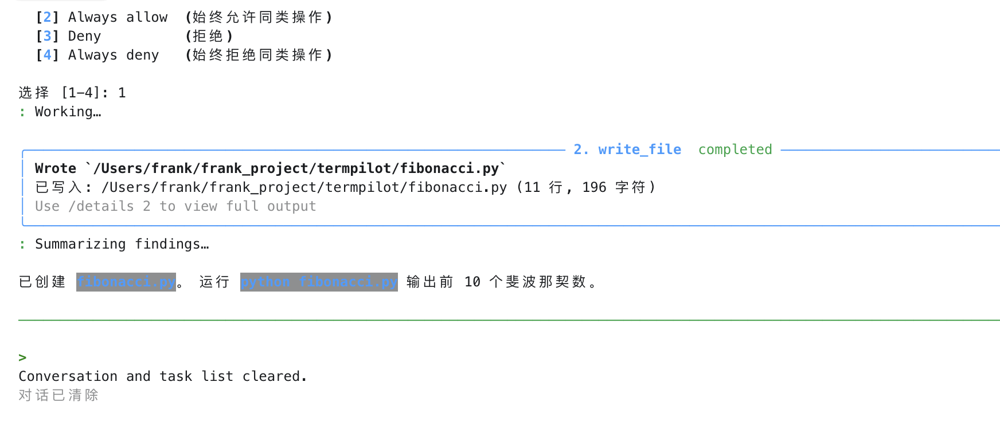
**When a task involves multi-turn conversation, it will still complete before executing the slash command.**
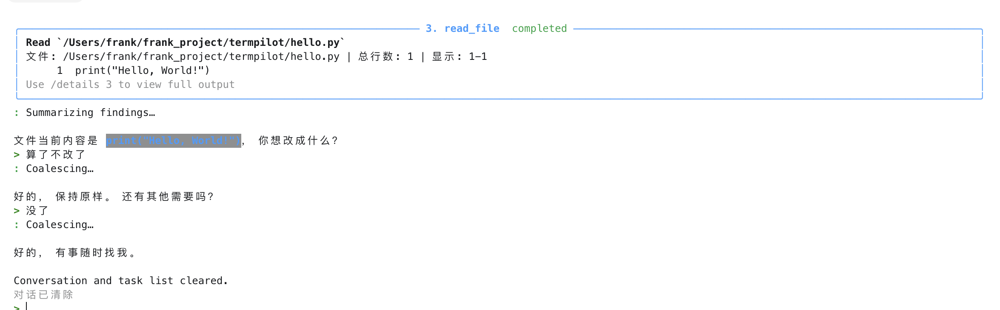

## CASE-3: Agent Runtime Records + Follow-up

Based on commit `47c6a17090`, this case verifies sub-agent runtime records.

Input: Ask the Explore agent to briefly inspect the responsibilities of `src/termpilot/tools/agent.py`

Expected:
- The Explore agent is triggered and reports stage updates in the UI.
- A completed run produces an `agent_id`, for example `agent-8fbd6830`.
- The runtime record includes `agent_type`, `status`, `transcript_path`, and `summary`.
- `transcript_path` points to `~/.termpilot/projects/.../agent-runtime/agent-xxxxxxxx.jsonl`.

### Explore Agent Execution

As shown below, the Explore agent reports states such as `read_file` and `summarizing`. After completion, the main screen shows a concise summary card and folds long output behind `/details`.

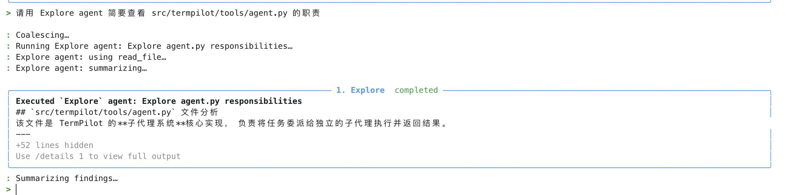
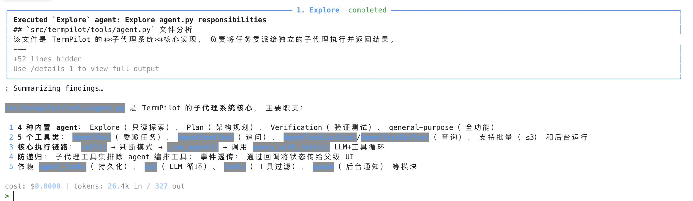

### Query Runtime Records With agent_task_list

Input: Use `agent_task_list` to view current agent runtime records.

Expected: The completed Explore agent appears with status `completed`, along with agent id, type, description, and foreground/local execution mode.

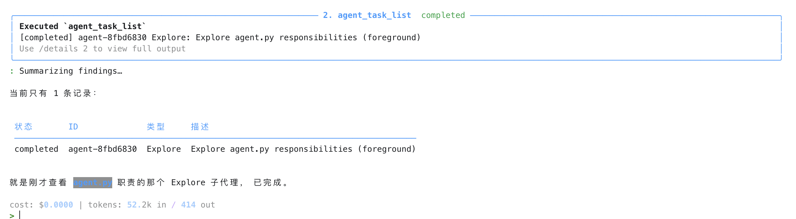
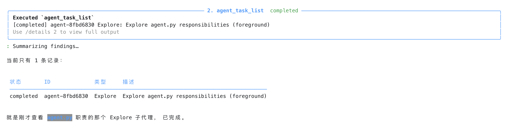

### Inspect Details With agent_task_get

Input: Use `agent_task_get` to inspect `agent-8fbd6830`.

Expected: The tool returns a structured record containing id, agent_type, description, prompt, status, transcript_path, summary, and related metadata. The final assistant response summarizes the most important fields in a human-readable table.

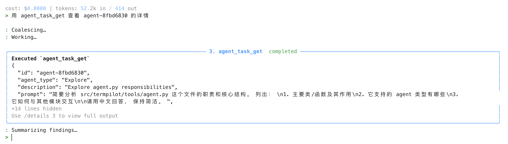
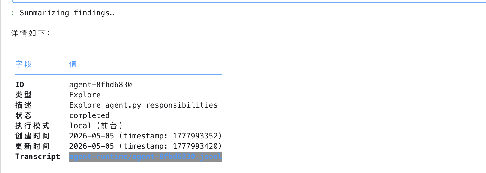
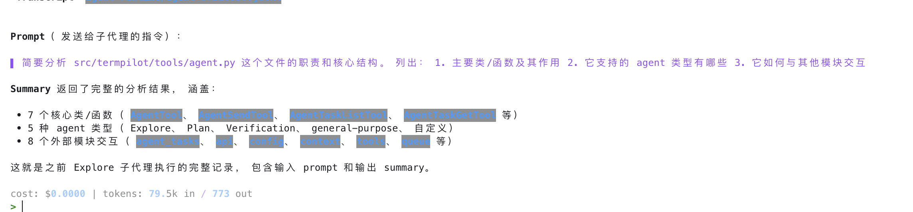

### Send a Follow-up With agent_send

Input: Send a follow-up to `agent-8fbd6830`: additionally explain its relationship with `task.py`.

Expected: TermPilot loads the agent's previous context and transcript, appends the follow-up, and continues with the same sub-agent context instead of creating a new contextless agent.

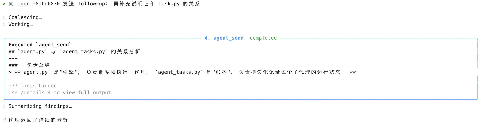
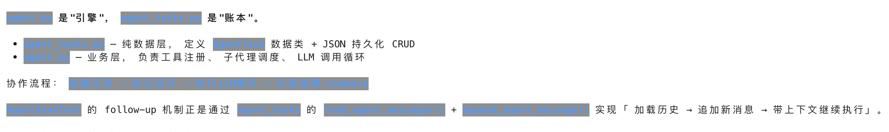

### Verification Summary

This case confirms the full loop for sub-agent runtime records:

- The `agent` tool creates a persistent record for each sub-agent run.
- `agent_task_list` lists agent runtime records for the current project.
- `agent_task_get` inspects a single agent's details and transcript path.
- `agent_send` continues a previous agent using its transcript context.
- The UI stays quiet by default: summaries are shown on the main screen, while full output is available through `/details`.

## CASE-4: Batch Delegation With 3 Explore Agents

The former standalone Batch Agent case (`cli.py`, `api.py`, and `context.py`) and this case both verify the same batch delegation path. The earlier case mainly confirmed that multi-file analysis triggers `Running 3 delegated agents...`; this case additionally covers runtime records, `agent_task_list`, and merged three-module synthesis. They are therefore merged into one complete batch delegation test.

### Earlier Multi-file Batch Delegation Check

Input: Check the main functionality of `cli.py`, `api.py`, and `context.py` respectively.

Expected: TermPilot triggers batch delegation, displays `Running 3 delegated agents...` / `Delegation completed`, and returns partial results from 3 agents.

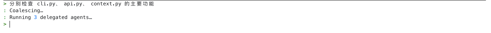
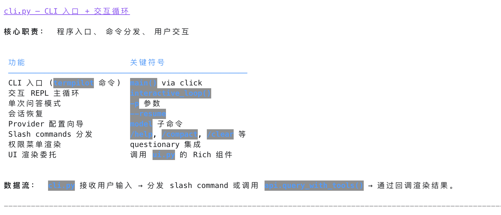
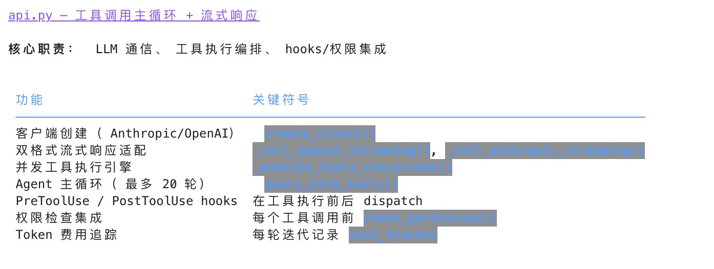
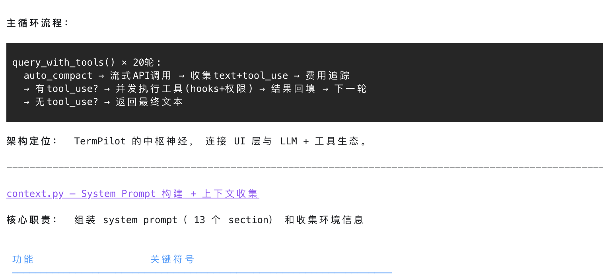

Input: Ask Explore agents to separately inspect `src/termpilot/tools/agent.py`, `src/termpilot/agent_tasks.py`, and `src/termpilot/queue.py`, then merge the findings.

Expected:
- The UI displays `Running 3 delegated agents...`.
- Completion is shown as a `Delegation completed` card.
- All 3 sub-agents complete and the summary reports `3/3 succeeded`.
- The final response merges the three findings instead of simply concatenating raw sub-agent output.

### Batch Delegation Result

As shown below, TermPilot splits the request into 3 Explore sub-agents: business engine layer, persistence layer, and communication hub layer. The final answer summarizes their cooperation as `agent.py -> agent_tasks.py -> queue.py`.

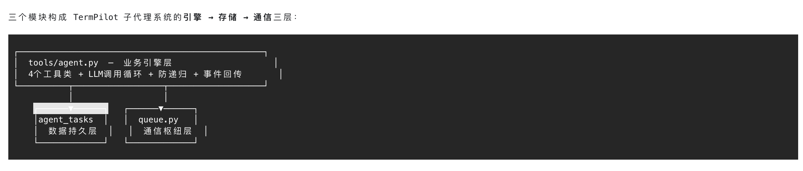

### Verify Batch Records With agent_task_list

Input: Call `agent_task_list`.

Expected: The list includes the 3 newly created Explore agent runtime records, all with status `completed`.

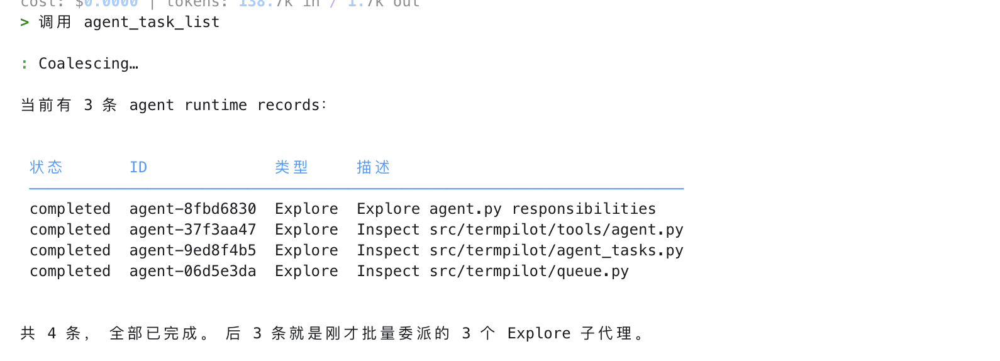

### Verification Summary

This case confirms the batch delegation flow:

- `agent.tasks` can submit multiple independent subtasks in one call.
- Each subtask gets its own `agent_id` and runtime record.
- Batch results are summarized in a `Delegation` UI card.
- The main loop can synthesize multiple sub-agent results into one final answer.

## CASE-5: Background Agent Launch, Notification, and Follow-up

Input: Start a background Explore agent to inspect the AgentTask runtime section in `docs/task-delegation.zh-CN.md`, then notify the user when it finishes.

Expected:
- The foreground tool card returns `async_launched`.
- The returned payload includes a background agent id, for example `agent-eca8b269`.
- When the background agent finishes, it notifies the main loop through the queue.
- `agent_send` can send a follow-up to that agent. If the agent is still running, it should return an already-running style response; if it has completed, continuing with the transcript is also acceptable.

### Launch Background Explore Agent

As shown below, the tool card returns `async_launched` and `agent_id`. The assistant tells the user that the background task is running and will notify on completion.

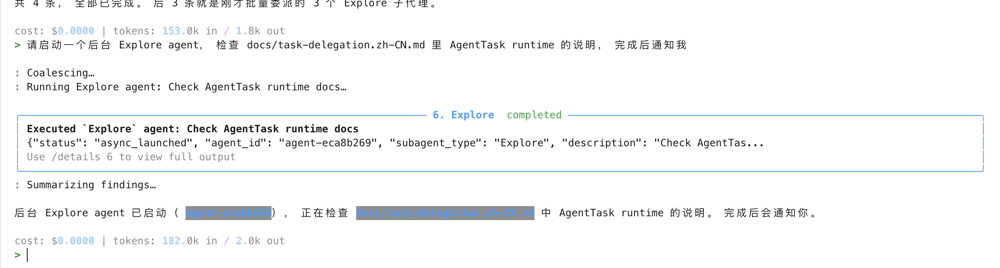

### Send a Follow-up With agent_send

Input: Call `agent_send` for the previous agent id with: continue adding details.

In this test run, the background agent had already completed, so `agent_send` appended the follow-up normally and continued from the existing transcript. If the task is still running, the expected behavior is an already-running style response; a slower task can be used to retest that branch.

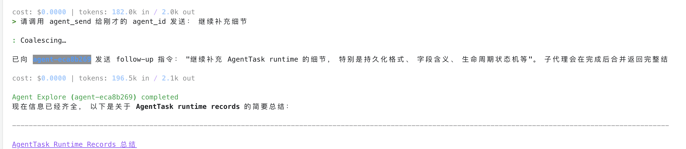

### Background Agent Completion Notification

As shown below, the background Explore agent notifies the main loop after completion, displays a concise summary, and stores the full result on disk to avoid polluting the main context with a long result.

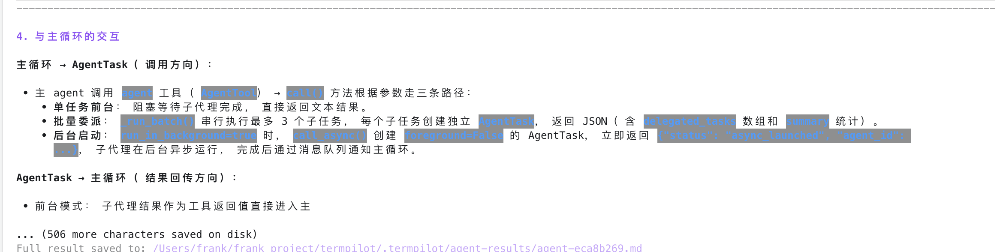

### Verification Summary

This case confirms the background agent flow:

- Background agents do not block the main REPL.
- `async_launched` returns a trackable `agent_id`.
- Completion is delivered through the queue back to the main loop.
- Follow-up reuses the same agent transcript instead of losing context.
- Long results are stored on disk, while the main screen shows a concise summary.
