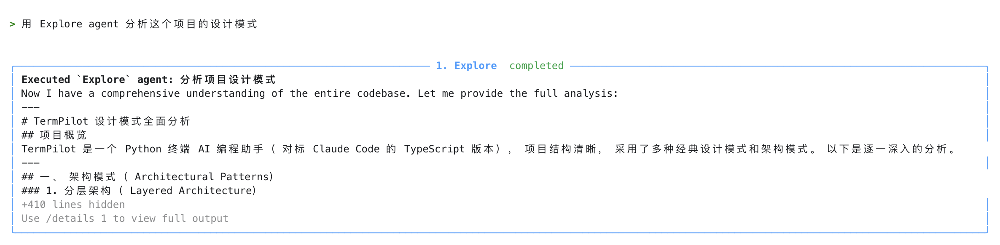
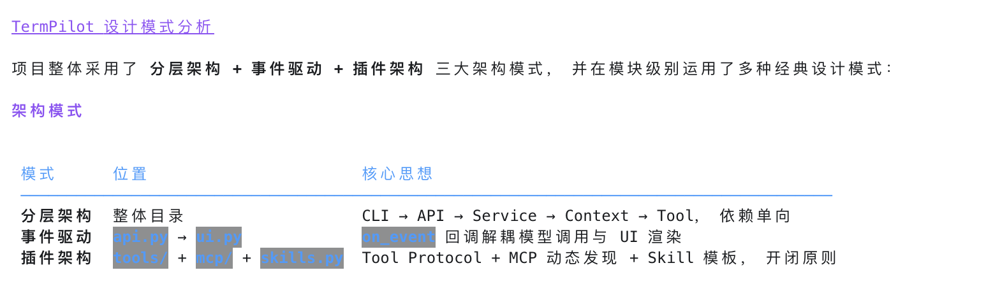
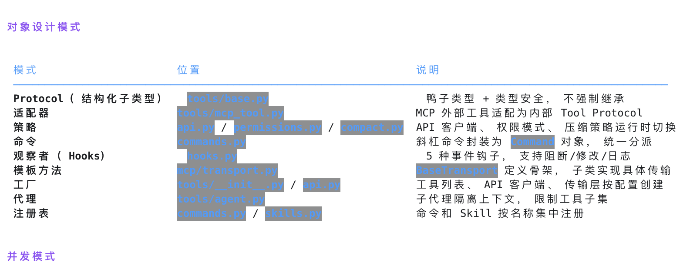
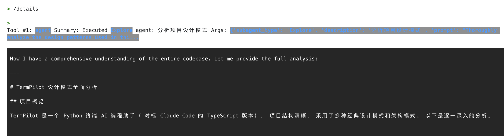
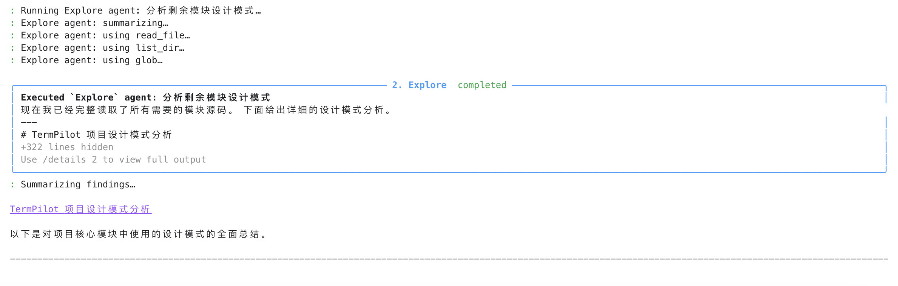
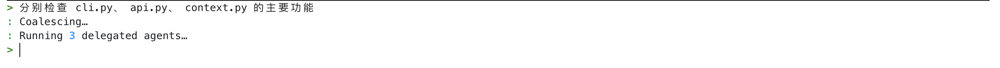
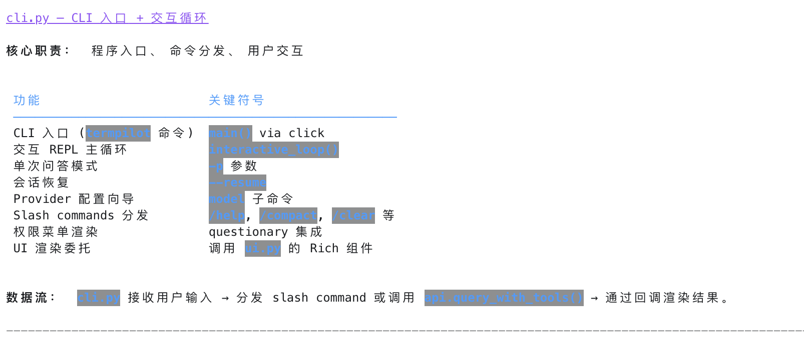
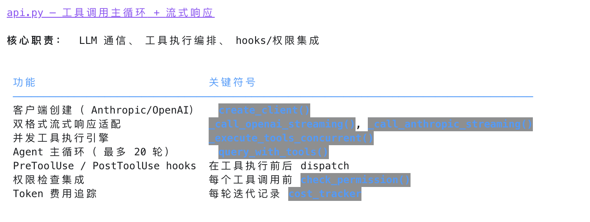
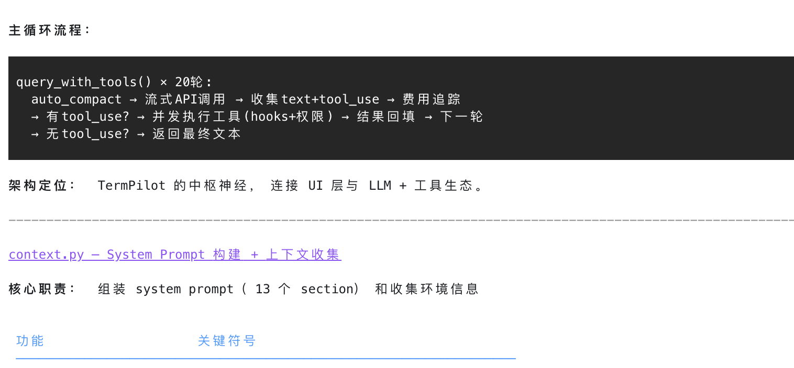
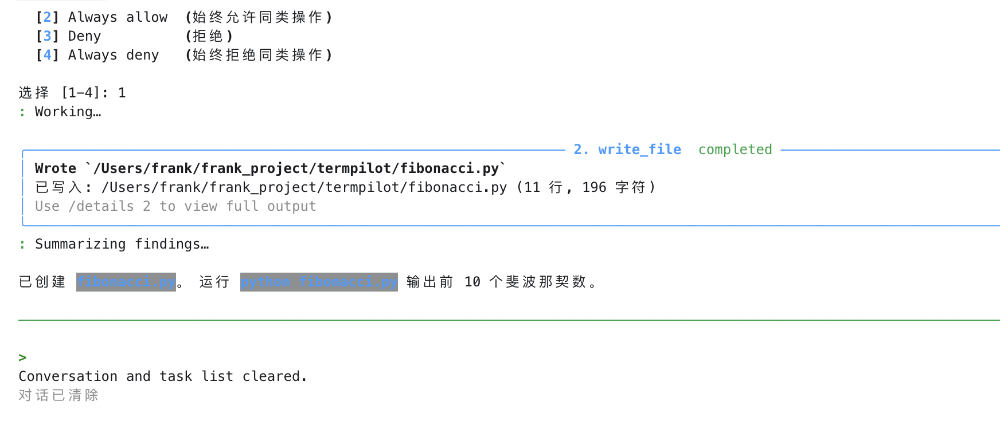

# 功能优化后测试用例

## CASE-1: Agent 工具触发
输入 "分析项目设计模式"，验证 Explore agent 被触发
### 改进前
大项目的阅读分析过程时间较久，看起来像一直卡在 Running Explore agent...
等很久突然冒出来结果，且输出不够概括，再输入 `/details` 命令展示的明细又比较突兀,如下图
输入后等了几分钟才出来下面的结果

### 改进后
如下图可以看到阶段子agent会回传状态，渐进输出进度，提高用户体验

**返回模块总结列表(部分图片):**

**/details 返回的部分图片**

## CASE-2: Batch Agent
输入: 分别检查 cli.py、api.py、context.py 的主要功能
预期: 触发 batch delegation，UI 显示 "Delegation completed"

### 改进后: running 3 delegated agents

### 3个agents的返回结果部分截图

## CASE-3: Slash 命令 + drain 并发安全
输入: 帮我写一个 hello world,等模型开始响应时（看到 Coalescing…），立刻输入: `/clear`

预期: `/clear` 会等当前修改文件的会话完成后再执行，不会丢失或错乱tasks

**如下图当输入一个任务后未等执行结束就输入slash command, 不会打断task的执行，避免了task执行状态混乱，
上下文逻辑偏差，保证了task stack顺序弹出**

**当task涉及多轮对话时，仍然会完成后再执行slash command**

